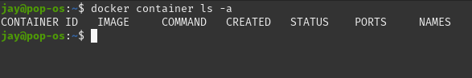
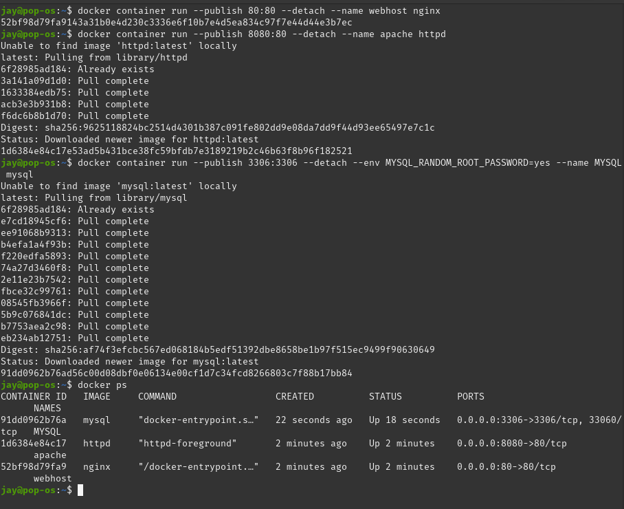
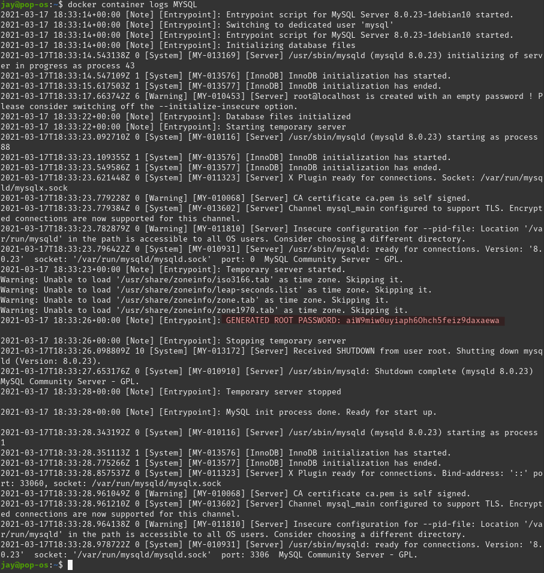
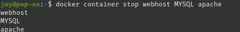
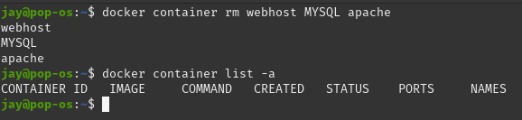

# Manage Multiple Containers
- - -
## Assigment Parameters
* Run an `nginx`, a `mysql`, and an `httpd` (apache) server. 
* Run all of them `--detach` (or `-d`), name them with `--name`. 
* nginx should listen on `80:80`, httpd on `8080:80`, mysql on `3306:3306`
* When running mysql, use the `--env` option (or `-e`) to pass in `MYSQL_RANDOM_ROOT_PASSWORD=yes`
* Use `docker container logs` on mysql to find the random password it created on startup
* Clean it all up with `docker container stop` and `docker container rm`
* Use `docker container ls` to ensure everything is correct before and after clean up. 

## Overview 
The first assignment of the course dealt with starting multiple containers with specific parameters e.g. names, ports, and evironmental variables. 

The commands we used for this assignment were:
* `docker container ls -a`
* `docker container run --publish <SPECIFIED PORT> --detach --env <ENVIRONMENTAL VARIABLE IF ANY> --name <NAME> <CONTAINER IMAGE NAME>`
* `docker ps`
* `docker container logs <CONTAINER NAME>`
* `docker container stop <CONTAINER NAME>`
* `docker container rm <CONTAINER NAME>`

## Steps in Action

